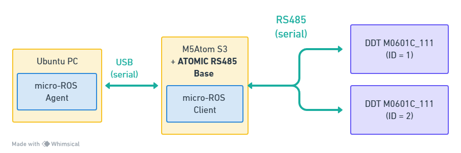

# m5_ros2_ddt_diff_drive
### 概要
ダイレクトドライブモーターM0601C_111を2つ使った差動二輪ロボットを制御するROSプログラムです。
制御にはM5Atom S3とmicro-ROSを使用しています。
<br/>
<br/>
<p align="center">

</p>
<br/>

### 動作確認環境
- PlatformIOを使ったビルド環境、micro-ROSエージェント実行環境  
  - PC: TRIGKEY Green G5  
  - OS: Ubuntu 22.04.3  
  - ROS2 : Humble  
  - Software: PlatformIO, VSCode, docker
<br/>

- micro-ROSクライアント実行環境とモーター
  - M5Atom S3
  - Atomic RS485 Base
  - DDT M0601C_111 ダイレクトドライブモーター x 2
<br/>

- micro-ROSクライアントとmicro-ROSエージェントの接続方法  
  - USBケーブルを使ったシリアル通信  
<br/>

### micro-ROSエージェントを起動方法(docker利用時)
シリアル通信のデバイスファイルを確認  
```
$ ls -l /dev/ttyACM* /dev/ttyUSB*
ls: '/dev/ttyUSB*' にアクセスできません: そのようなファイルやディレクトリはありません
crw-rw---- 1 root dialout 166, 0  2月 24 16:46  /dev/ttyACM0
```
<br/>

M5Atom S3が /dev/ttyACM0 で接続している場合、下記コマンドでmicro-ROSエージェント起動。  
```
docker run -it --rm -v /dev:/dev -v /dev/shm:/dev/shm --privileged --net=host microros/micro-ros-agent:$ROS_DISTRO serial --dev  /dev/ttyAMC0 -v6
```
<br/>

### 起動順序
エージェント → クライアントの順で起動する必要があります。  
エージェントを起動したら、M5Atomを一度リセットすることでエージェント → クライアントの順になります。  
<br/>

### 動作確認
正常起動し、 /cmd_vel トピックを受け取ると、その内容に応じてモーターを動かします。  
/cmd_velトピックの配信には様々な方法があります。  
次の方法はコマンドラインで /cmd_vel を配信する方法です。  
```
ros2 topic pub --once /cmd_vel geometry_msgs/msg/Twist "{linear: {x: 0.5, y: 0.0, z: 0.0}, angular: {x: 0.0, y: 0.0, z: 0.0}}"
```
<br/>
このトピックと受け取ると、差動二輪ロボットが前進します。  

### 注意
- あらかじめ、ダイレクトドライブモーターのIDを設定しておく必要があります。
  - 左モーターがID1、右モーターがID2。  
- M5unified を使ってなるべく機種に依存しないように作っていますが、M5Atom S3 以外の対応予定はありません。
<br/>


### リンク
[M5Atom S3のドキュメント](https://docs.m5stack.com/en/core/AtomS3)  
[Atomic RS485 Baseのドキュメント](https://docs.m5stack.com/en/atom/Atomic%20RS485%20Base)  
他の機種でAtomic RS485 Baseを使う場合は、このドキュメントを参考にGPIO番号を設定する必要があります。  
<br/>
[DDT M0601C_111 ダイレクトドライブモーター(スイッチサイエンス)](https://www.switch-science.com/products/7646)  


